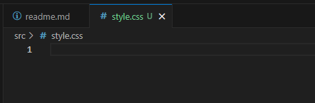

# Generacion del proyecto en vite

``` bash
npm create vite@latest
```


## Abrimos el proyecto

``` bash
cd learning-center
code .
```

## Instalamos la base de vite/vue

``` bash
npm install 
npm run dev
```


## Inicializamos git

``` bash
git init
```


# Limpieza del proyecto

## Eliminamos "public/vite.svg"

``` bash
rm public/vite.svg
```

## Añadimos "public/acme-logo.svg"

``` bash
curl https://raw.githubusercontent.com/upc-pre-202401-si730-sw56/learning-center-main/main/public/acme-logo.svg?token=GHSAT0AAAAAACQM67FG4RVQKC644WL7GJYSZRJU3FQ -o public/acme-logo.svg
```

## Actualizamos "index.html"

``` html
<!doctype html>
<html lang="en">
  <head>
    <meta charset="UTF-8" />
    <link rel="icon" type="image/svg+xml" href="/acme-logo.svg
" />
    <meta name="viewport" content="width=device-width, initial-scale=1.0" />
    <title>Vite + Vue</title>
  </head>
  <body>
    <div id="app"></div>
    <script type="module" src="/src/main.js"></script>
  </body>
</html>
```

## Renombramos "src/App.vue"

``` bash
mv src/App.vue src/app.vue
```

## Actualizamos "src/app.vue"

``` vue
<script setup>
</script>

<template>
</template>

<style scoped>
</style>
```

## Eliminamos el contenido de "src/styles.css"



## Eliminamos "src/components/" y "src/assets/"

``` bash
rm -r src/components 
rm -r src/assets
```


## Realizamos un commit

``` bash
git add .
git commit -m "chore: initial commit."
```


# Instalacion de dependencias

## Instalamos las dependencias base de nuestro proyecto

``` bash
npm i primevue primeicons primeflex vue-router axios
```


## Realizamos un commit

``` bash
git add .
git commit -m "chore: added dependendies."
```


# Creacion de componentes publicos (Options API)

## Creamos componente "src/public/pages/home.component.vue"

``` vue
<script>
export default {
  name: "home",
  title: "Home"
}
</script>

<template>
  <div class="w-full align-content-center">
    <h1>Home</h1>
    <p>Welcome to ACME Learning Center.</p>
  </div>
</template>
```


## Creamos componente src/public/pages/about.component.vue

``` vue
<script>
export default {
  name: "about",
  title: "About Us"
}
</script>

<template>
  <div class="w-full align-content-center">
    <h1>About us</h1>
    <p>ACME Learning Center is an Education Business Platform, part of ACME Corporation.</p>
  </div>
</template>
```


## Creamos componente src/public/pages/page-not-found.component.vue

``` vue
<script>
export default {
  name: "page-not-found"
}
</script>

<template>
  <div class="w-full align-content-center">
    <h1>Page Not Found</h1>
  </div>
</template>
```


## Realizamos un commit

``` bash
git add .
git commit -m "feat: added public components."
```


# Creacion de rutas

## Creamos el archivo "src/router.index.js"

``` javascript
import {createRouter, createWebHistory} from "vue-router";
import HomeComponent from "../public/pages/home.component.vue";
import AboutComponent from "../public/pages/about.component.vue";
import PageNotFoundComponent from "../public/pages/page-not-found.component.vue";

const router = createRouter({
    history: createWebHistory(),
    routes: [
        { path: '/home', component: HomeComponent, meta: { title: 'Home' }, },
        { path: '/about', component: AboutComponent, meta: { title: 'About us' }, },
        { path: '/:pathMatch(.*)*', component: PageNotFoundComponent },
        { path: '/', redirect: '/home' }
    ]
});

router.beforeEach((to, from, next) => {
    let baseTitle = 'ACME Learning Center';
    document.title = `${ baseTitle } | ${to.meta["title"]}`;
    next();
});
export default router;
```