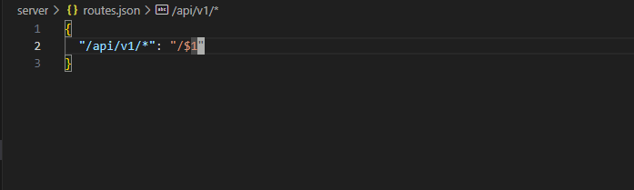
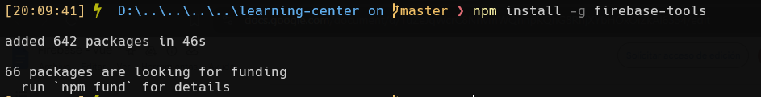
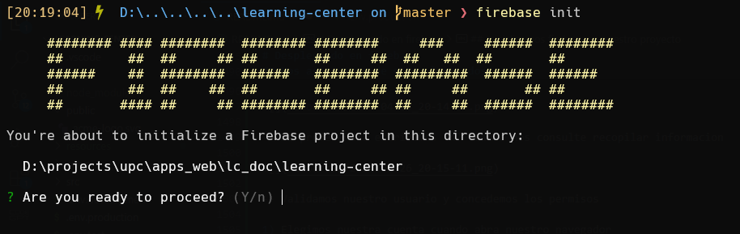

- [ACME Learning Center Web Application](#acme-learning-center-web-application)
  - [Summary](#summary)
  - [Features](#features)
  - [Dependencies](#dependencies)
- [Generacion del proyecto en vite](#generacion-del-proyecto-en-vite)
  - [Abrimos el proyecto](#abrimos-el-proyecto)
  - [Instalamos la base de vite/vue](#instalamos-la-base-de-vitevue)
  - [Inicializamos git](#inicializamos-git)
- [Limpieza del proyecto](#limpieza-del-proyecto)
  - [Eliminamos "public/vite.svg"](#eliminamos-publicvitesvg)
  - [Descargamos el logo "public/acme-logo.svg"](#descargamos-el-logo-publicacme-logosvg)
  - [Descargamos y posicionamos en "public/acme-logo.svg"](#descargamos-y-posicionamos-en-publicacme-logosvg)
  - [Actualizamos "index.html"](#actualizamos-indexhtml)
  - [Renombramos "src/App.vue"](#renombramos-srcappvue)
  - [Actualizamos "src/app.vue"](#actualizamos-srcappvue)
  - [Eliminamos "src/components/" y "src/assets/"](#eliminamos-srccomponents-y-srcassets)
  - [Realizamos un commit](#realizamos-un-commit)
- [Instalacion de dependencias](#instalacion-de-dependencias)
  - [Instalamos las dependencias base de nuestro proyecto](#instalamos-las-dependencias-base-de-nuestro-proyecto)
  - [Realizamos un commit](#realizamos-un-commit-1)
- [Creacion de componentes publicos (Options API)](#creacion-de-componentes-publicos-options-api)
  - [Creamos componente "src/public/pages/home.component.vue"](#creamos-componente-srcpublicpageshomecomponentvue)
  - [Creamos componente src/public/pages/about.component.vue](#creamos-componente-srcpublicpagesaboutcomponentvue)
  - [Creamos componente src/public/pages/page-not-found.component.vue](#creamos-componente-srcpublicpagespage-not-foundcomponentvue)
  - [Realizamos un commit](#realizamos-un-commit-2)
- [Creacion de rutas](#creacion-de-rutas)
  - [Creamos el archivo "src/router.index.js"](#creamos-el-archivo-srcrouterindexjs)
  - [Actualizamos "src/main.js"](#actualizamos-srcmainjs)
  - [Actualizamos "src/app.vue"](#actualizamos-srcappvue-1)
  - [Realizamos un commit](#realizamos-un-commit-3)
- [Instalación de json-server](#instalación-de-json-server)
  - [Instalamos json-server](#instalamos-json-server)
  - [Creamos "server/db.json"](#creamos-serverdbjson)
  - [Creamos "server/routes.json"](#creamos-serverroutesjson)
- [Ejecución de json-server](#ejecución-de-json-server)
  - [Ejecutamos json-server desde nuestro directorio base](#ejecutamos-json-server-desde-nuestro-directorio-base)
  - [Visualizamos la ruta en nuestro navegador](#visualizamos-la-ruta-en-nuestro-navegador)
  - [Realizamos un commit](#realizamos-un-commit-4)
- [Creacion de los environments](#creacion-de-los-environments)
  - [Creamos ".env.development"](#creamos-envdevelopment)
  - [Creamos ".env.test"](#creamos-envtest)
  - [Creamos ".env.production"](#creamos-envproduction)
  - [Realizamos un commit](#realizamos-un-commit-5)
- [Creacion de instancia axios](#creacion-de-instancia-axios)
  - [Crear "src/shared/services/http-common.js"](#crear-srcsharedserviceshttp-commonjs)
  - [Realizamos un commit](#realizamos-un-commit-6)
- [Crearcion de entitdad "Tutorial"](#crearcion-de-entitdad-tutorial)
  - [Crear "src/learning/model/tutorial.entity.js"](#crear-srclearningmodeltutorialentityjs)
  - [Realizamos un commit](#realizamos-un-commit-7)
- [Creacion del servicio "Tutorials"](#creacion-del-servicio-tutorials)
  - [Crear "src/learning/services/tutorials-api.service.js"](#crear-srclearningservicestutorials-apiservicejs)
  - [Realizamos un commit](#realizamos-un-commit-8)
- [Creación de componentes Tutorials, Tutorial Form](#creación-de-componentes-tutorials-tutorial-form)
  - [Crear componente "src/learning/pages/tutorial-list.component.vue"](#crear-componente-srclearningpagestutorial-listcomponentvue)
  - [Crear componente "src/learning/components/tutorial-item-create-and-edit-dialog.component.vue"](#crear-componente-srclearningcomponentstutorial-item-create-and-edit-dialogcomponentvue)
  - [Crear componente "src/learning/components/tutorial-item-delete-confirmation-dialog.component.vue"](#crear-componente-srclearningcomponentstutorial-item-delete-confirmation-dialogcomponentvue)
  - [Crear componente "src/learning/components/tutorial-subset-delete-confirmation-dialog.component.vue"](#crear-componente-srclearningcomponentstutorial-subset-delete-confirmation-dialogcomponentvue)
  - [Actualizamos "src/router/index.js"](#actualizamos-srcrouterindexjs)
  - [Actualizamos "src/app.vue"](#actualizamos-srcappvue-2)
  - [Realizamos un commit](#realizamos-un-commit-9)
- [Actualizamos el "README.md"](#actualizamos-el-readmemd)
  - [Actualizamos "README.md"](#actualizamos-readmemd)
  - [Realizamos un commit](#realizamos-un-commit-10)
- [Desplegamos nuestro json-server](#desplegamos-nuestro-json-server)
  - [Creamos un repositorio publico](#creamos-un-repositorio-publico)
  - [Cargamos el archivo "db.json" al repositorio](#cargamos-el-archivo-dbjson-al-repositorio)
  - [Generamos el commit](#generamos-el-commit)
  - [Tengamos en cuenta el nombre del usuario y del repo](#tengamos-en-cuenta-el-nombre-del-usuario-y-del-repo)
  - [Generamos el url para desplegar nuestra base de datos](#generamos-el-url-para-desplegar-nuestra-base-de-datos)
  - [Volvemos a nuestro proyecto y actualizamos nuestro endpoint en ".env.production"](#volvemos-a-nuestro-proyecto-y-actualizamos-nuestro-endpoint-en-envproduction)
  - [Realizamos un commit](#realizamos-un-commit-11)
- [Exportamos previo al despliegue](#exportamos-previo-al-despliegue)
  - [Realizamos un build](#realizamos-un-build)
  - [Instalamos "serve" para probar el build realizado](#instalamos-serve-para-probar-el-build-realizado)
  - [Ejecutamos "serve" con nuestro directorio "dist" generado](#ejecutamos-serve-con-nuestro-directorio-dist-generado)
- [Desplegando en firebase](#desplegando-en-firebase)
  - [Nos registramos en firebase](#nos-registramos-en-firebase)
  - [Instalamos "firebase-tools" para registrar nuestro proyecto](#instalamos-firebase-tools-para-registrar-nuestro-proyecto)
  - [Nos aseguramos de estar logueados](#nos-aseguramos-de-estar-logueados)
  - [Inicializamos firebase en nuestro proyecto](#inicializamos-firebase-en-nuestro-proyecto)
  - [Configuramos en orden](#configuramos-en-orden)
  - [Actualizamos nuestro firebase.json generado](#actualizamos-nuestro-firebasejson-generado)
  - [Realizamos el deploy](#realizamos-el-deploy)
  - [Actualizamos nuestro ".gitignore" para firebase](#actualizamos-nuestro-gitignore-para-firebase)
  - [Realizamos un commit](#realizamos-un-commit-12)
  - [Visualizamos nuestro deploy](#visualizamos-nuestro-deploy)
- [Anexos](#anexos)
  - [Home](#home)
  - [About](#about)
  - [Page Not Found](#page-not-found)
  - [Tutorials](#tutorials)

# ACME Learning Center Web Application

## Summary
ACME Learning Center Application, illustrating REST client with axios on a simulated API with json-server, using Vue Framework and PrimeVue UI Component Library. The application also shows how to support in-app navigation routing.

## Features
- REST client with axios
- Simulated API with json-server
- PrimeVue UI Component Library
- In-app navigation routing
- Reusable components

## Dependencies
- Vue
- Axios
- PrimeVue
- Vue Router
- json-server

# Generacion del proyecto en vite

``` bash
npm create vite@latest
```


## Abrimos el proyecto

``` bash
cd learning-center
code .
```


## Instalamos la base de vite/vue

``` bash
npm install 
npm run dev
```


## Inicializamos git

``` bash
git init
```


# Limpieza del proyecto

## Eliminamos "public/vite.svg"

``` bash
rm public/vite.svg
```

## Descargamos el logo "public/acme-logo.svg"

## Descargamos y posicionamos en "public/acme-logo.svg"
- link: https://github.com/upc-pre-202401-si730-sw56/learning-center-main/blob/main/public/acme-logo.svg


## Actualizamos "index.html"

``` html
<!doctype html>
<html lang="en">
  <head>
    <meta charset="UTF-8" />
    <link rel="icon" type="image/svg+xml" href="/acme-logo.svg
" />
    <meta name="viewport" content="width=device-width, initial-scale=1.0" />
    <title>Vite + Vue</title>
  </head>
  <body>
    <div id="app"></div>
    <script type="module" src="/src/main.js"></script>
  </body>
</html>
```


## Renombramos "src/App.vue"

``` bash
mv src/App.vue src/app.vue
```

## Actualizamos "src/app.vue"

``` vue
<script setup>
</script>

<template>
</template>

<style scoped>
</style>
```


## Eliminamos "src/components/" y "src/assets/"

``` bash
rm -r src/components 
rm -r src/assets
```


## Realizamos un commit

``` bash
git add .
git commit -m "chore: initial commit."
```


# Instalacion de dependencias

## Instalamos las dependencias base de nuestro proyecto

``` bash
npm i primevue primeicons primeflex vue-router axios
```


## Realizamos un commit

``` bash
git add .
git commit -m "chore: added dependendies."
```


# Creacion de componentes publicos (Options API)

## Creamos componente "src/public/pages/home.component.vue"

``` vue
<script>
export default {
  name: "home",
  title: "Home"
}
</script>

<template>
  <div class="w-full align-content-center">
    <h1>Home</h1>
    <p>Welcome to ACME Learning Center.</p>
  </div>
</template>
```


## Creamos componente src/public/pages/about.component.vue

``` vue
<script>
export default {
  name: "about",
  title: "About Us"
}
</script>

<template>
  <div class="w-full align-content-center">
    <h1>About us</h1>
    <p>ACME Learning Center is an Education Business Platform, part of ACME Corporation.</p>
  </div>
</template>
```


## Creamos componente src/public/pages/page-not-found.component.vue

``` vue
<script>
export default {
  name: "page-not-found"
}
</script>

<template>
  <div class="w-full align-content-center">
    <h1>Page Not Found</h1>
  </div>
</template>
```


## Realizamos un commit

``` bash
git add .
git commit -m "feat: added public components."
```


# Creacion de rutas

## Creamos el archivo "src/router.index.js"

``` js
import {createRouter, createWebHistory} from "vue-router";
import HomeComponent from "../public/pages/home.component.vue";
import AboutComponent from "../public/pages/about.component.vue";
import PageNotFoundComponent from "../public/pages/page-not-found.component.vue";

const router = createRouter({
    history: createWebHistory(),
    routes: [
        { path: '/home', component: HomeComponent, meta: { title: 'Home' }, },
        { path: '/about', component: AboutComponent, meta: { title: 'About us' }, },
        { path: '/:pathMatch(.*)*', component: PageNotFoundComponent },
        { path: '/', redirect: '/home' }
    ]
});

router.beforeEach((to, from, next) => {
    let baseTitle = 'ACME Learning Center';
    document.title = `${ baseTitle } | ${to.meta["title"]}`;
    next();
});
export default router;
```


## Actualizamos "src/main.js"

``` js
import { createApp } from 'vue'
import './style.css'
import App from './app.vue'

// Import router
import router from "./router/index.js";

// PrimeVue
import PrimeVue from 'primevue/config';

// PrimeVue CSS
import 'primeflex/primeflex.css';

// PrimeVue Icons
import 'primeicons/primeicons.css';

// PrimeVue Material Design Theme
import 'primevue/resources/themes/mdc-light-indigo/theme.css';

// PrimeVue Services
import ToastService         from 'primevue/toastservice';
import ConfirmationService  from "primevue/confirmationservice";
import DialogService        from "primevue/dialogservice";

// PrimeVue Components
import DataTable        from "primevue/datatable";
import Column           from "primevue/column";
import ConfirmDialog    from "primevue/confirmdialog";
import Row              from "primevue/row";
import Toolbar          from "primevue/toolbar";
import InputText        from "primevue/inputtext";
import Textarea         from "primevue/textarea";
import Button           from "primevue/button";
import Sidebar          from "primevue/sidebar";
import Menu             from "primevue/menu";
import Dialog           from "primevue/dialog";
import Toast            from "primevue/toast";
import Dropdown         from "primevue/dropdown";
import Tag              from "primevue/tag";
import Card             from "primevue/card";
import FileUpload       from "primevue/fileupload";
import IconField        from "primevue/iconfield";
import InputIcon        from "primevue/inputicon";
import InputNumber      from "primevue/inputnumber";
import FloatLabel       from "primevue/floatlabel";
import Checkbox         from "primevue/checkbox";
import Rating           from "primevue/rating";

createApp(App)
    .use(router)
    .use(PrimeVue, { ripple: true })
    .use(DialogService)
    .use(ConfirmationService)
    .use(ToastService)
    .component('pv-button',         Button)
    .component('pv-card',           Card)
    .component('pv-column',         Column)
    .component('pv-confirm-dialog', ConfirmDialog)
    .component('pv-checkbox',       Checkbox)
    .component('pv-data-table',     DataTable)
    .component('pv-dialog',         Dialog)
    .component('pv-dropdown',       Dropdown)
    .component('pv-file-upload',    FileUpload)
    .component('pv-float-label',    FloatLabel)
    .component('pv-icon-field',     IconField)
    .component('pv-input-icon',     InputIcon)
    .component('pv-input-text',     InputText)
    .component('pv-input-number',   InputNumber)
    .component('pv-menu',           Menu)
    .component('pv-rating',         Rating)
    .component('pv-row',            Row)
    .component('pv-sidebar',        Sidebar)
    .component('pv-tag',            Tag)
    .component('pv-textarea',       Textarea)
    .component('pv-toolbar',        Toolbar)
    .component('pv-toast',          Toast)
    .mount('#app')
```


## Actualizamos "src/app.vue"

``` vue
<script>
export default {
  name: "app",
  title: "ACME Learning Center",

  data() {
    return {
      drawer: false,
      items: [
        {label: 'Home', to: '/home'},
        {label: 'About', to: '/about'},
      ]
    }
  },
  methods: {
    toggleDrawer() {
      this.drawer = !this.drawer;
    },

  }
}
</script>

<template>
  <pv-toast></pv-toast>
  <header>
    <pv-toolbar class="bg-primary" fixed>
      <template #start>
        <pv-button class="p-button-text text-white" icon="pi pi-bars" @click="toggleDrawer()"></pv-button>
        <h3>ACME Learning Center</h3>

        <div class="flex-column">
          <router-link v-for="item in items" :key="item.label" v-slot="{ navigate, href}" :to="item.to" custom>
            <pv-button :href="href" class="p-button-text text-white" @click="navigate">
              {{ item.label }}
            </pv-button>
          </router-link>
        </div>
      </template>
    </pv-toolbar>
  </header>
  <pv-sidebar v-model:visible="drawer"></pv-sidebar>
  <router-view></router-view>
</template>

<style scoped>
</style>
```


## Realizamos un commit

``` bash
git add .
git commit -m "feat(in-app-navigation): added in-app navigation initial routes."
```


# Instalación de json-server

## Instalamos json-server

``` bash
npm i -g json-server@0.17.4
```


## Creamos "server/db.json"

``` json
{
  "tutorials": [
    {
      "id": 1,
      "title": "The Vue Tutorials",
      "description": "The best tips and tutorials for Vue.",
      "published": false,
      "status": "Unpublished"
    },
    {
      "id": 2,
      "title": "Amazing Microsoft .NET",
      "description": "Weekly tutorials about .NET and ASP.NET Core.",
      "published": false
    },
    {
      "id": 3,
      "title": "JavaScript for All",
      "description": "Tips and tricks about JavaScript from scratch.",
      "published": false
    },
    {
      "id": 4,
      "title": "Vue Unleashed",
      "description": "Vue at its best.",
      "published": false
    },
    {
      "id": 5,
      "title": "ASP.NET Code Advanced",
      "description": "What nobody tells you about ASP.NET Core.",
      "published": true,
      "status": "Published"
    },
    {
      "id": 6,
      "title": "The Vue Zone",
      "description": "Incredible articles about Vue",
      "published": false,
      "status": "Unpublished"
    }
  ]
}
```


## Creamos "server/routes.json"

``` json
{
  "/api/v1/*": "/$1"
}
```



# Ejecución de json-server

## Ejecutamos json-server desde nuestro directorio base

``` bash
cd server
json-server --watch db.json --routes routes.json -p 3000
```


## Visualizamos la ruta en nuestro navegador 


## Realizamos un commit

``` bash
git add .
git commit -m "chore(server): added json-server configuration files."
```


# Creacion de los environments

## Creamos ".env.development"

``` bash
VITE_API_BASE_URL="http://localhost:3000/api/v1"
```


## Creamos ".env.test"

``` bash
VITE_API_BASE_URL="http://localhost:3000/api/v1"
```


## Creamos ".env.production"

``` bash
VITE_API_BASE_URL="http://localhost:3000/api/v1"
```


## Realizamos un commit

``` bash
git add .
git commit -m "chore: added environments to project."
```


# Creacion de instancia axios

## Crear "src/shared/services/http-common.js"

``` js
/**  axios default configs */
import axios from "axios";

const API_BASE_URL = import.meta.env.VITE_API_BASE_URL;

/**
 * Axios instance
 * @summary http axios instance creation with default configs
 * @type {AxiosInstance}
 *
 */

const http = axios.create({
    baseURL: API_BASE_URL,
    headers: { 'Content-type': 'application/json' }
});

export default http;
```


## Realizamos un commit

``` bash
git add .
git commit -m "feat(acme-service-client): added axios common instance with default configuration."
```


# Crearcion de entitdad "Tutorial"

## Crear "src/learning/model/tutorial.entity.js"

``` js
/**
 * Tutorial
 * @description Tutorial entity
 */
export class Tutorial {
    constructor(id, title, description, published) {
        this.id = id;
        this.title = title;
        this.description = description;
        this.published = published;
        this.status = this.published === true ? 'Published' : 'Unpublished';
    }

    /**
     * Create a new Tutorial instance from a displayableTutorial
     * @param displayableTutorial - The displayableTutorial to create the Tutorial from
     * @returns {Tutorial}
     */
    static fromDisplayableTutorial(displayableTutorial) {
        return new Tutorial(
            displayableTutorial.id,
            displayableTutorial.title,
            displayableTutorial.description,
            displayableTutorial.status.label === 'Published');
    }

    /**
     * Convert a tutorial to a displayable tutorial
     * @param tutorial - The tutorial to convert
     * @returns {{description: *, id, title, status: (string)}}
     */
    static toDisplayableTutorial(tutorial) {
        return {
            id: tutorial.id,
            title: tutorial.title,
            description: tutorial.description,
            status: tutorial.published === true ? 'Published' : 'Unpublished'
        };
    }

}
```

## Realizamos un commit

``` bash
git add .
git commit -m "feat(tutorials): added tutorial entity."
```


# Creacion del servicio "Tutorials"

## Crear "src/learning/services/tutorials-api.service.js"

``` js
import http from "../../shared/services/http-common.js";

/**
 * TutorialsApiService class
 * @description Service class for making HTTP requests to the API
 */

export class TutorialsApiService {
    /**
     * Get all tutorials
     * @returns {Promise<axios.AxiosResponse<any>>}
     */
    getAll() {
        return http.get('/tutorials');
    }

    /**
     * Get tutorial by id
     * @param id
     * @returns {Promise<axios.AxiosResponse<any>>}
     */
    getById(id) {
        return http.get(`/tutorials/${id}`);
    }

    /**
     * Create a new tutorial
     * @param tutorialResource - tutorial object to create
     * @returns {Promise<axios.AxiosResponse<any>>}
     */
    create(tutorialResource) {
        return http.post('/tutorials', tutorialResource);
    }

    /**
     * Update a tutorial
     * @param id - tutorial id to update
     * @param tutorialResource - tutorial object with data
     * @returns {Promise<axios.AxiosResponse<any>>}
     */
    update(id, tutorialResource) {
        return http.put(`/tutorials/${id}`, tutorialResource);
    }

    /**
     * Delete a tutorial
     * @param id - tutorial id to delete
     * @returns {Promise<axios.AxiosResponse<any>>}
     */
    delete(id) {
        return http.delete(`/tutorials/${id}`);
    }

    /**
     * Delete all tutorials that match the given title
     * @param title - tutorial title to apply as criteria
     * @returns {Promise<axios.AxiosResponse<any>>}
     */
    findByTitle(title) {
        return http.get(`/tutorials?title=${title}`);
    }
}
```


## Realizamos un commit

``` bash
git add .
git commit -m "feat(tutorials): added tutorials service."
```


# Creación de componentes Tutorials, Tutorial Form

## Crear componente "src/learning/pages/tutorial-list.component.vue"

``` vue
<script>
import {TutorialsApiService} from "../services/tutorials-api.service.js";
import {FilterMatchMode} from "primevue/api";
import TutorialCatalogueItemDeleteConfirmationDialog
  from "../components/tutorial-item-delete-confirmation-dialog.component.vue";
import TutorialSubsetDeleteConfirmationDialog
  from "../components/tutorial-subset-delete-confirmation-dialog.component.vue";
import {Tutorial} from "../model/tutorial.entity.js";
import TutorialItemCreateAndEditDialog from "../components/tutorial-item-create-and-edit-dialog.component.vue";

export default {
  name: "tutorial-list",
  title: "Tutorials",
  components: {
    TutorialItemCreateAndEditDialog,
    TutorialSubsetDeleteConfirmationDialog,
    TutorialCatalogueItemDeleteConfirmationDialog
  },
  data() {
    return {
      title: "Tutorials",
      tutorials: [],
      tutorialDialog: false,
      deleteTutorialDialog: false,
      deleteTutorialsDialog: false,
      tutorial: null,
      selectedTutorials: null,
      filters: {},
      submitted: false,
      statuses: [
        {label: "Published", value: "published"},
        {label: "Unpublished", value: "unpublished"},
      ],
      tutorialsService: null,
    }
  },
  created() {
    this.tutorialsService = new TutorialsApiService();
    this.tutorialsService.getAll()
        .then(response => {
          this.tutorials = response.data;
          this.tutorials = this.tutorials.map(tutorial => {
            return Tutorial.toDisplayableTutorial(tutorial);
          });
        });
    this.initFilters();
  },

  methods: {

    //#region Helper Methods

    notifySuccessfulAction(message) {
      this.$toast.add({severity: "success", summary: "Success", detail: message, life: 3000,});
    },

    findIndexById(id) {
      return this.tutorials.findIndex((tutorial) => tutorial.id === id);
    },

    initFilters() {
      this.filters = {global: {value: null, matchMode: FilterMatchMode.CONTAINS}};
    },

    getSeverity(status) {
      switch (status) {
        case 'Published': return 'success';
        case 'Unpublished': return 'info';
        default:  return null;
      }
    },

    //#endregion Helper Methods

    //#region Event Handlers

    onDeleteItemConfirm() {
      this.deleteTutorial();
    },

    onDeleteItemCancel() {
      this.deleteTutorialDialog = false;
    },

    onDeleteSubsetConfirm() {
      this.deleteSelectedTutorials();
    },

    onDeleteSubsetCancel() {
      this.deleteTutorialsDialog = false;
    },

    onNewItem() {
      this.tutorial = {};
      this.submitted = false;
      this.tutorialDialog = true;
    },

    onAddOrUpdateItemCancel() {
      this.tutorialDialog = false;
      this.submitted = false;
    },

    onSaveItem() {
      this.submitted = true;
      if (this.tutorial.title.trim()) {
        if (this.tutorial.id) {
          this.updateTutorial();
        } else {
          this.createTutorial();
        }
        this.tutorialDialog = false;
        this.tutorial = {};
      }

    },

    onEditItemRequested(tutorial) {
      this.tutorial = {...tutorial};
      this.tutorialDialog = true;
    },

    onDeleteItemRequested(tutorial) {
      this.tutorial = tutorial;
      this.deleteTutorialDialog = true;
    },

    onExportRequested() {
      this.$refs.dt.exportCSV();
    },

    onConfirmDeleteSelected() {
      this.deleteTutorialsDialog = true;
    },

    //#endregion Event Handlers

    //#region Data Actions

    createTutorial() {
      this.tutorial.id = 0;
      this.tutorial = Tutorial.fromDisplayableTutorial(this.tutorial);
      this.tutorialsService.create(this.tutorial)
          .then((response) => {
            this.tutorial = Tutorial.toDisplayableTutorial(response.data);
            this.tutorials.push(this.tutorial);
            this.notifySuccessfulAction("Tutorial Created");
          });
    },

    updateTutorial() {
      this.tutorial = Tutorial.fromDisplayableTutorial(this.tutorial);
      this.tutorialsService
          .update(this.tutorial.id, this.tutorial)
          .then((response) => {
            this.tutorials[this.findIndexById(response.data.id)] =
                Tutorial.toDisplayableTutorial(response.data);
            this.notifySuccessfulAction("Tutorial Updated");
          });
    },

    deleteTutorial() {
      this.tutorialsService.delete(this.tutorial.id)
          .then(() => {
            this.tutorials = this.tutorials.filter((t) => t.id !== this.tutorial.id);
            this.deleteTutorialDialog = false;
            this.tutorial = {};
            this.notifySuccessfulAction("Tutorial Deleted");
          });
    },

    deleteSelectedTutorials() {
      this.selectedTutorials.forEach((tutorial) => {
        this.tutorialsService.delete(tutorial.id).then(() => {
          this.tutorials = this.tutorials.filter((t) => t.id !== this.tutorial.id);
        });
      });
      this.deleteTutorialsDialog = false;
      this.notifySuccessfulAction("Tutorials Deleted");
    }

    //#endregion Data Actions
  },
}
</script>

<template>
  <div class="tutorials">
    <div>
      <!-- Toolbar Section -->
      <pv-toolbar class="mb-4">
        <template #start>
          <pv-button class="mr-2" icon="pi pi-plus" label="New" severity="success" @click="onNewItem"/>
          <pv-button :disabled="!selectedTutorials || !selectedTutorials.length"
                     icon="pi pi-trash" label="Delete" severity="danger" @click="onConfirmDeleteSelected"/>
        </template>
        <template #end>
          <pv-button icon="pi pi-download" label="Export" severity="help" @click="onExportRequested($event)"></pv-button>
        </template>
      </pv-toolbar>

      <!-- Data Table Section -->
      <pv-data-table ref="dt" v-model:selection="selectedTutorials"
                     :filters="filters"
                     :paginator="true"
                     :rows="10"
                     :rowsPerPageOptions="[5, 10, 25]"
                     :value="tutorials"
                     currentPageReportTemplate="Showing {first} to {last} of {totalRecords} tutorials"
                     dataKey="id"
                     paginatorTemplate="FirstPageLink PrevPageLink PageLinks NextPageLink LastPageLink CurrentPageReport RowsPerPageDropdown"
                     responsiveLayout="scroll">
        <template #header>
          <div class="table-header gap-2 align-items-center justify-content-between">
            <h4 class="m-0">Manage Tutorials</h4>
            <span class="p-input-icon-left">
              <i class="pi pi-search"/>&nbsp;
              <pv-input-text v-model="filters['global'].value" placeholder="Search..."/>
            </span>
          </div>
        </template>

        <pv-column :exportable="false" selectionMode="multiple" style="width: 3rem"/>
        <pv-column :sortable="true" field="id" header="Id" style="min-width: 12rem"/>
        <pv-column :sortable="true" field="title" header="Title" style="min-width: 16rem"/>
        <pv-column :sortable="true" field="description" header="Description" style="min-width: 16rem"/>
        <pv-column :sortable="true" field="status" header="Status" style="min-width: 12rem">
          <template #body="slotProps">
            <pv-tag :severity="getSeverity(slotProps.data.status)" :value="slotProps.data.status"/>
          </template>
        </pv-column>
        <pv-column :exportable="false" style="min-width: 8rem">
          <template #body="slotProps">
            <pv-button class="mr-2" icon="pi pi-pencil" outlined rounded @click="onEditItemRequested(slotProps.data)"></pv-button>
            <pv-button icon="pi pi-trash" outlined rounded severity="danger" @click="onDeleteItemRequested(slotProps.data)"></pv-button>
          </template>
        </pv-column>
      </pv-data-table>

      <!-- Add/Edit Tutorial Dialog -->
      <tutorial-item-create-and-edit-dialog :statuses="statuses" :tutorial="tutorial" v-bind:visible="tutorialDialog"
                                          v-on:cancel="onAddOrUpdateItemCancel"
                                          v-on:save="onSaveItem"/>

      <!-- Delete Selected Tutorial Confirmation Dialog -->
      <tutorial-catalogue-item-delete-confirmation-dialog :item="tutorial" v-bind:visible="deleteTutorialDialog"
                                                          @cancel="onDeleteItemCancel"
                                                          v-on:confirm="onDeleteItemConfirm"/>

      <!-- Delete Selected Tutorials Confirmation Dialog -->
      <tutorial-subset-delete-confirmation-dialog :subset="selectedTutorials" v-bind:visible="deleteTutorialsDialog"
                                                  v-on:cancel="onDeleteSubsetCancel"
                                                  v-on:confirm="onDeleteSubsetConfirm"/>

    </div>
  </div>
</template>

<style scoped>
</style>
```


## Crear componente "src/learning/components/tutorial-item-create-and-edit-dialog.component.vue"

``` vue
<script>
export default {
  name: "tutorial-item-create-and-edit-dialog",
  props: {
    tutorial: null,
    visible: Boolean,
    statuses: Array,
  },
  data() {
    return {
      submitted: false,
    }
  },
  methods: {
    getSeverity(status) {
      switch (status) {
        case 'Published': return 'success';
        case 'Unpublished': return 'info';
        default: return null;
      }
    },

    onCancel() {
      this.$emit('cancel');
    },

    onSave() {
      this.submitted = true;
      if (this.tutorial.title) {
        this.$emit('save', this.tutorial);
      }
    },

  }

}
</script>

<template>
  <!-- Add/Edit Tutorial Dialog -->
  <pv-dialog v-bind:visible="visible"
             :modal="true"
             :style="{width: '450px'}"
             class="p-fluid"
             header="Tutorial Information">
    <div class="field mt-3">
                  <span class="p-float-label">
                      <pv-input-text v-model.trim="tutorial.title"
                                     :class="{'p-invalid': submitted && !tutorial.title}"
                                     autofocus
                                     required="true"
                                     type="text"/>
                      <label for="title">Title</label>
                      <small v-if="submitted && !tutorial.title" class="p-error">Title is required.</small></span>
    </div>

    <div class="field">
                  <span class="p-float-label">
                      <pv-input-text v-model.trim="tutorial.description"
                                     cols="20"
                                     required="false"
                                     rows="2" type="text"/>
                      <label for="description">Description</label>
                  </span>
    </div>

    <div class="field">
      <pv-dropdown id="published"
                   v-model="tutorial.status"
                   :options="statuses"
                   optionLabel="label"
                   placeholder="Select an Status">
        <template #value="slotProps">
          <div v-if="slotProps.value && slotProps.value.value">
            <pv-tag :severity="getSeverity(slotProps.value.label)" :value="slotProps.value.value"/>
          </div>
          <div v-else-if="slotProps.value && !slotProps.value.value">
            <pv-tag :severity="getSeverity(slotProps.value)" :value="slotProps.value"/>
          </div>
          <span v-else>{{ slotProps.placeholder }}</span>
        </template>
      </pv-dropdown>
    </div>
    <template #footer>
      <pv-button label="Cancel" class="p-button-text" icon="pi pi-times" @click="onCancel"/>
      <pv-button label="Save" class="p-button-text" icon="pi pi-check" @click="onSave"/>
    </template>
  </pv-dialog>
</template>

<style scoped>
</style>
```


## Crear componente "src/learning/components/tutorial-item-delete-confirmation-dialog.component.vue"

``` vue
<script>
export default {
  name: "tutorial-item-delete-confirmation-dialog",
  props: {
    item: null,
    visible: false,
  },
  methods: {
    // User Interface Event Handlers
    onCancel() {
      this.$emit('cancel');
    },

    onConfirm() {
      this.$emit('confirm', this.item);
    },
  }
}
</script>

<template>
  <!-- Delete Tutorial Confirmation Dialog -->
  <pv-dialog v-bind:visible="visible" :modal="true" :style="{width: '450px'}" header="Confirm">
    <div class="confirmation-content">
      <i class="pi pi-exclamation-triangle p-mr-3" style="font-size: 2rem"/>
      <span v-if="item">Are you sure you want to delete <b>{{ item.title }}</b>?</span>
    </div>

    <template #footer>
      <pv-button label="No" class="p-button-text" icon="pi pi-times" @click="onCancel"/>
      <pv-button label="Yes" class="p-button-text" icon="pi pi-check" @click="onConfirm"/>
    </template>
  </pv-dialog>
</template>

<style scoped>
.confirmation-content {
  display: flex;
  align-items: center;
  justify-content: center;
}

</style>
```


## Crear componente "src/learning/components/tutorial-subset-delete-confirmation-dialog.component.vue"

``` vue
<script>
export default {
  name: "tutorial-subset-delete-confirmation-dialog",
  props: {
    subset: Array,
    visible: Boolean,
  },
  methods: {
    onConfirm() {
      this.$emit('confirm', this.subset);
    },

    onCancel() {
      this.$emit('cancel');
    },
  }
}
</script>

<template>
  <!-- Delete Selected Tutorials Confirmation Dialog -->
  <pv-dialog v-bind:visible="visible" :modal="true" :style="{width: '450px'}" header="Confirm">
    <div class="confirmation-content">
      <i class="pi pi-exclamation-triangle p-mr-3" style="font-size: 2rem"/>
      <span v-if="subset">Are you sure you want to delete the selected tutorials?</span>
    </div>

    <template #footer>
      <pv-button label="No" class="p-button-text" icon="pi pi-times" @click="onCancel"/>
      <pv-button label="Yes" class="p-button-text" icon="pi pi-check" @click="onConfirm"/>
    </template>
  </pv-dialog>
</template>

<style scoped>
.confirmation-content {
  display: flex;
  align-items: center;
  justify-content: center;
}
</style>
```


## Actualizamos "src/router/index.js"

``` js
import {createRouter, createWebHistory} from "vue-router";
import HomeComponent from "../public/pages/home.component.vue";
import AboutComponent from "../public/pages/about.component.vue";
import PageNotFoundComponent from "../public/pages/page-not-found.component.vue";
import TutorialListComponent from "../learning/pages/tutorial-list.component.vue";

const router = createRouter({
    history: createWebHistory(),
    routes: [
        { path: '/home', component: HomeComponent, meta: { title: 'Home' }, },
        { path: '/about', component: AboutComponent, meta: { title: 'About us' }, },
        { path: '/tutorials', component: TutorialListComponent, meta: { title: 'Tutorials' } },
        { path: '/:pathMatch(.*)*', component: PageNotFoundComponent },
        { path: '/', redirect: '/home' }
    ]
});

router.beforeEach((to, from, next) => {
    let baseTitle = 'ACME Learning Center';
    document.title = `${ baseTitle } | ${to.meta["title"]}`;
    next();
});
export default router;
```

## Actualizamos "src/app.vue"

``` vue
<script>
export default {
  name: "app",
  title: "ACME Learning Center",

  data() {
    return {
      drawer: false,
      items: [
        {label: 'Home', to: '/home'},
        {label: 'About', to: '/about'},
        {label: 'Tutorials', to: '/tutorials'},
      ]
    }
  },
  methods: {
    toggleDrawer() {
      this.drawer = !this.drawer;
    },

  }
}
</script>

<template>
  <pv-toast></pv-toast>
  <header>
    <pv-toolbar class="bg-primary" fixed>
      <template #start>
        <pv-button class="p-button-text text-white" icon="pi pi-bars" @click="toggleDrawer()"></pv-button>
        <h3>ACME Learning Center</h3>

        <div class="flex-column">
          <router-link v-for="item in items" :key="item.label" v-slot="{ navigate, href}" :to="item.to" custom>
            <pv-button :href="href" class="p-button-text text-white" @click="navigate">
              {{ item.label }}
            </pv-button>
          </router-link>
        </div>
      </template>
    </pv-toolbar>
  </header>
  <pv-sidebar v-model:visible="drawer"></pv-sidebar>
  <router-view></router-view>
</template>

<style scoped>
</style>
```


## Realizamos un commit

``` bash
git add .
git commit -m "feat(tutorials): added tutorials and tutorial form components."
```


# Actualizamos el "README.md"

## Actualizamos "README.md"

``` markdown
    # ACME Learning Center Web Application

    ## Summary
    ACME Learning Center Application, illustrating REST client with axios on a simulated API with json-server, using Vue Framework and PrimeVue UI Component Library. The application also shows how to support in-app navigation routing.

    ## Features
    - REST client with axios
    - Simulated API with json-server
    - PrimeVue UI Component Library
    - In-app navigation routing
    - Reusable components

    ## Dependencies
    - Vue
    - Axios
    - PrimeVue
    - Vue Router
    - json-server

    ## Mock API Start
    Write the following commands in the terminal to start the mock API server.
    ```bash
    cd server
    json-server --watch db.json --routes routes.json
    ```
```

## Realizamos un commit

``` bash
git add .
git commit -m "docs: updated documentation."
``` 


# Desplegamos nuestro json-server

## Creamos un repositorio publico


## Cargamos el archivo "db.json" al repositorio


## Generamos el commit


## Tengamos en cuenta el nombre del usuario y del repo

**Ejemplo: ** 0renzo0loli0/learning-center-db
- Este sera el url para los proximos pasos

## Generamos el url para desplegar nuestra base de datos

** base: ** https://my-json-server.typicode.com/
** data: ** 0renzo0loli0/learning-center-db
** URL: **  https://my-json-server.typicode.com/0renzo0loli0/learning-center-db


- Como se ve tenemos nuetro link para la base de datos completa "db"
- y para el "tutorials"


## Volvemos a nuestro proyecto y actualizamos nuestro endpoint en ".env.production"

``` bash
VITE_API_BASE_URL="https://my-json-server.typicode.com/0renzo0loli0/learning-center-db"
```


## Realizamos un commit

``` bash
git add .
git commit -m "feat(production): updated env production baseurl"
```


# Exportamos previo al despliegue

## Realizamos un build

``` bash
npm run build
``` 


## Instalamos "serve" para probar el build realizado

``` bash
npm install -g serve
``` 


## Ejecutamos "serve" con nuestro directorio "dist" generado

``` bash
serve -s dist
```


# Desplegando en firebase

## Nos registramos en firebase 

[Firebase](https://firebase.google.com/)

## Instalamos "firebase-tools" para registrar nuestro proyecto

``` bash
npm install -g firebase-tools
```



## Nos aseguramos de estar logueados

``` bash
firebase logout
firebase login
```


- De preferencia escribimos "n" cuando nos consulte recopilar informacion


- Validamos nuestro usuario y concedemos los permisos

1) Elegimos nuestra cuenta cuando abra nuestro navegador 
2) Le damos continuar 
3) Le damos Permitir


## Inicializamos firebase en nuestro proyecto

``` bash
firebase init
```



## Configuramos en orden

1) proceed "Y"


2)  Solo seleccionamos "Hosting: Configure files for Firebase Hosting and (optionally) set up GitHub Action deploys"


3) Seleccionamos "Create a new project"


4) Le damos un ID unico


5) Damos enter para que el id sea el mismo que el nombre del proyecto


6) Le decimos que "dist" sera nuestra carpeta a distribuir


7) Escribimos "n"


8) Escribimos "n"


9) Escribimos "n"


10) Finalizado


## Actualizamos nuestro firebase.json generado

``` json
{
  "hosting": {
    "public": "dist",
    "ignore": [
      "firebase.json",
      "**/.*",
      "**/node_modules/**"
    ]
  },

  "rewrites": [
    {
      "source": "**",
      "destination": "/index.html"
    }
  ]
}
```


## Realizamos el deploy

``` bash
firebase deploy --only hosting
```


## Actualizamos nuestro ".gitignore" para firebase

- Añadimos el siguiente codigo

```bash
# Firebase cache
.firebase/
```


## Realizamos un commit

```bash
git add .
git commit -m "feat(gitignore): updated gitignore for firebase"
```


## Visualizamos nuestro deploy

[Deploy](https://learningcentersi730.web.app)

# Anexos

## Home


## About


## Page Not Found


## Tutorials

